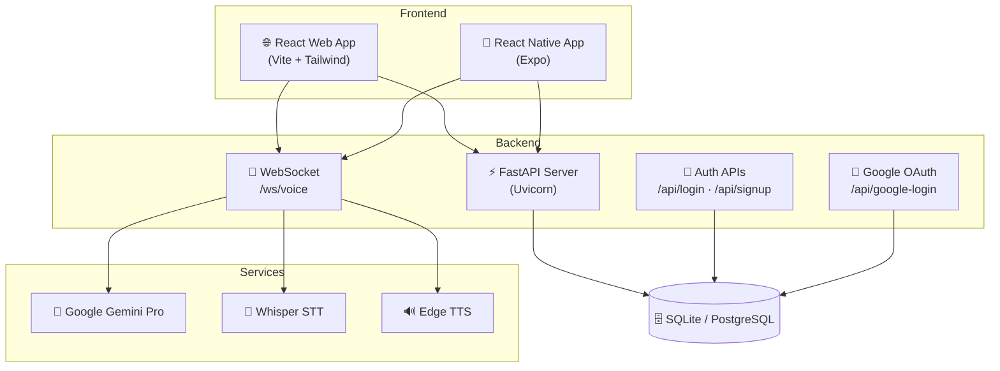

<p align="center">
  
  
  
  
  
</p>

<h1 align="center">🏥 MedAI OS</h1>
<h3 align="center">A Next-Generation Medical Operating System</h3>
<p align="center">
  <em>AI-driven health insights · Instant telehealth · Smart pharmacy · One unified platform</em>
</p>

---

## 📖 Overview

**MedAI OS** is a comprehensive, full-stack healthcare platform designed to bridge the gap between patients, AI-driven diagnostics, medical professionals, and essential health services.

Built with a scalable, platform-agnostic architecture, MedAI serves both a **React web dashboard** and a **React Native mobile application** from a single, high-performance **Python FastAPI backend**.

> **🏆 Pitched at Ideastorm Competition, IIT Roorkee**

---

## 🌟 Core Features

| Feature | Description | Tech |
|---------|-------------|------|
| 🤖 **AI Health Expert** | Real-time conversational health assistant with preliminary symptom checking | Gemini Pro + WebSockets |
| 👨‍⚕️ **Smart Doctor Directory** | Symptom-based specialist search (e.g., "heart" → Cardiologist) with instant booking | React + Intelligent Mapping |
| 💊 **E-Pharmacy** | Full medicine store with Rx upload, automatic discounts, and cart management | React + REST APIs |
| 🔬 **Lab Test Booking** | Premium health packages with home-collection tracking | React + REST APIs |
| 🏕️ **Health Camps** | Discover and register for free medical camps in your region | React |
| 🥗 **Diet Planner** | AI-curated meal plans based on health goals and dietary preferences | React |
| 🔐 **Secure Auth** | Email/password registration + **Google OAuth 2.0** sign-in | FastAPI + Google Identity |
| 📱 **Cross-Platform** | Shared backend serves both web and mobile applications | FastAPI + CORS |

---

## 🛠️ Technical Architecture



### Stack Breakdown

| Layer | Technology | Purpose |
|-------|-----------|---------|
| **Web Frontend** | React 19 · Vite · Tailwind CSS · React Router | SPA with premium UI |
| **Mobile Frontend** | React Native · Expo | Cross-platform mobile app |
| **Backend** | FastAPI · Uvicorn · Python 3.10+ | REST APIs + WebSocket server |
| **AI/ML** | Google Gemini Pro · OpenAI Whisper · Edge TTS | Chat, speech-to-text, text-to-speech |
| **Auth** | Google OAuth 2.0 · SHA-256 · google-auth | Secure user authentication |
| **ORM** | SQLModel · SQLAlchemy | Database abstraction |
| **Database** | SQLite (dev) / PostgreSQL (prod) | Persistent data storage |

---

## 📂 Project Structure

```text
MedAI_v2/
├── backend/                    # Python FastAPI Server
│   ├── app/
│   │   ├── main.py             # Core API routes, auth, & WebSocket endpoints
│   │   ├── database.py         # Database engine & session management
│   │   ├── models/
│   │   │   └── models.py       # SQLModel schemas (User, Prescription, VitalSign)
│   │   └── api/
│   │       └── voice_agent.py  # Gemini-powered voice chat WebSocket
│   ├── .env                    # 🔒 API keys & DB credentials (git-ignored)
│   ├── requirements.txt        # Python dependencies
│   └── venv/                   # Virtual environment
│
├── web/                        # React Vite Web Application
│   ├── src/
│   │   ├── App.jsx             # Route definitions
│   │   ├── components/
│   │   │   └── Layout.jsx      # Sidebar navigation + responsive shell
│   │   ├── pages/
│   │   │   ├── Landing.jsx     # Public landing page with animations
│   │   │   ├── Login.jsx       # Auth page (email + Google OAuth)
│   │   │   ├── Dashboard.jsx   # Main dashboard with health tracker
│   │   │   ├── Doctors.jsx     # Smart doctor search & booking
│   │   │   ├── Pharmacy.jsx    # E-pharmacy store
│   │   │   ├── LabTests.jsx    # Diagnostic test packages
│   │   │   ├── AIExpert.jsx    # Real-time AI chat (WebSocket)
│   │   │   ├── Camps.jsx       # Health camp discovery
│   │   │   └── DietPlan.jsx    # Diet planning
│   │   ├── data/               # Frontend mock databases (doctors, pharmacy)
│   │   └── services/
│   │       └── api.js          # API service layer
│   ├── .env                    # 🔒 Google Client ID (git-ignored)
│   └── tailwind.config.js      # Tailwind configuration
│
└── mobile/                     # React Native Mobile App (Expo)
    └── src/
        ├── screens/            # Mobile screens
        └── components/         # Reusable mobile components
```

---

## 🚀 Local Installation & Setup

### Prerequisites

- **Node.js** 18+ and **npm**
- **Python** 3.10+
- **Git**

### 1️⃣ Clone the Repository

```bash
git clone https://github.com/your-username/MedAI_v2.git
cd MedAI_v2
```

### 2️⃣ Backend Setup

```bash
cd backend
python -m venv venv

# Activate virtual environment
# Windows:
venv\Scripts\activate
# macOS/Linux:
source venv/bin/activate

pip install -r requirements.txt
```

Create a `backend/.env` file:

```env
GEMINI_API_KEY=your_google_gemini_api_key
GOOGLE_CLIENT_ID=your_google_oauth_client_id.apps.googleusercontent.com
```

Start the server:

```bash
uvicorn app.main:app --host 0.0.0.0 --port 8000 --reload
```

> ✅ Backend live at **http://127.0.0.1:8000**
> 📄 Interactive docs at **http://127.0.0.1:8000/docs**

### 3️⃣ Web Dashboard Setup

```bash
cd web
npm install
```

Create a `web/.env` file:

```env
VITE_GOOGLE_CLIENT_ID=your_google_oauth_client_id.apps.googleusercontent.com
```

Start the dev server:

```bash
npm run dev
```

> ✅ Web app live at **http://localhost:5173**

---

## 🔑 API Endpoints

| Method | Endpoint | Description |
|--------|----------|-------------|
| `GET` | `/` | Server status check |
| `GET` | `/health` | Database health check |
| `GET` | `/api/health-check` | Web dashboard bridge |
| `POST` | `/api/signup` | Register new user (name, email, password) |
| `POST` | `/api/login` | Authenticate user (email, password) |
| `POST` | `/api/google-login` | Google OAuth sign-in (credential token) |
| `WS` | `/ws/voice` | Real-time AI voice chat (Gemini + Whisper + TTS) |

---

## 🗺️ Route Map

| URL | Page | Auth Required |
|-----|------|:---:|
| `/` | Landing Page | ❌ |
| `/login` | Login / Signup | ❌ |
| `/dashboard` | Main Dashboard | ✅ |
| `/dashboard/doctors` | Doctor Search & Booking | ✅ |
| `/dashboard/pharmacy` | E-Pharmacy Store | ✅ |
| `/dashboard/lab-tests` | Lab Test Packages | ✅ |
| `/dashboard/ai-expert` | AI Health Chat | ✅ |
| `/dashboard/camps` | Health Camps | ✅ |
| `/dashboard/diet-plan` | Diet Planner | ✅ |

---

## 🔒 Environment Variables

| Variable | Location | Purpose |
|----------|----------|---------|
| `GEMINI_API_KEY` | `backend/.env` | Google Gemini Pro API key |
| `GOOGLE_CLIENT_ID` | `backend/.env` | Google OAuth client ID (token verification) |
| `VITE_GOOGLE_CLIENT_ID` | `web/.env` | Same client ID (browser-side Google Identity Services) |

---

## 🧪 Development Notes

- **Database**: Uses SQLite (`medai.db`) for development. Switch to PostgreSQL for production by updating `database.py`.
- **CORS**: Configured to allow `http://localhost:5173` (Vite dev server).
- **Vite Proxy**: `/api/*` requests are proxied to the FastAPI backend during development.
- **WebSocket**: The AI Expert connects directly to `ws://127.0.0.1:8000/ws/voice`.
- **Passwords**: Hashed with SHA-256. Google-authenticated users are stored with a `GOOGLE_AUTH` marker.

---

## 🎨 Design Philosophy

MedAI OS follows a **premium, modern design language**:

- 🌊 **Glassmorphism** — Frosted glass effects on navigation and cards
- 🎨 **Gradient Palette** — Blue (#007AFF) → Purple (#6200EA) → Coral (#FF6B6B)
- ✨ **Micro-animations** — Hover lifts, floating icons, count-up stats, rotating text
- 📱 **Responsive** — Fully adaptive from mobile to ultrawide displays
- 🌙 **Clean Typography** — System font stack with bold headings and relaxed body text

---

## 🎓 Academic Context

Architected and developed by **Aditya Singh**
B.Tech Data Science · Buddha Institute of Technology (BIT), Gorakhpur

> **Prepared for project submission and pitched at the Ideastorm Competition, IIT Roorkee**

---

<p align="center">
  Made with ❤️ by Aditya Singh · © 2026 MedAI Technologies
</p>
